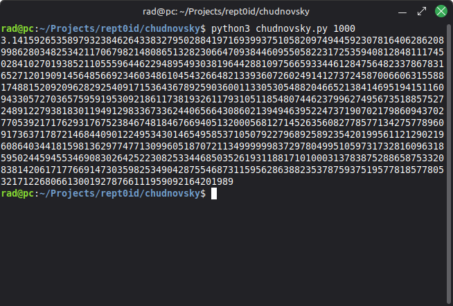

# chudnovsky
Implementation of Chudnovsky algorithm calculating n digits of π 



## How to run

### 1. Preparation
#### 1.1.1 Python's virtual environment
```
python3 -m venv venv
```
#### 1.1.2 Python's virtual environment activation
If on Linux:
```
source venv/bin/activate
```
Else, if on Windows:
```
.\venv\Scripts\activate
```

#### 1.2 Installation of dependencies
```
pip install -r requirements.txt
```

### 2. Running !
```
python3 chudnovsky.py <N>
```
Where n is the number of digits of your choice.
For example:
```
python3 chudnovsky.py 1000
```

## How to test
```
pytest
```
